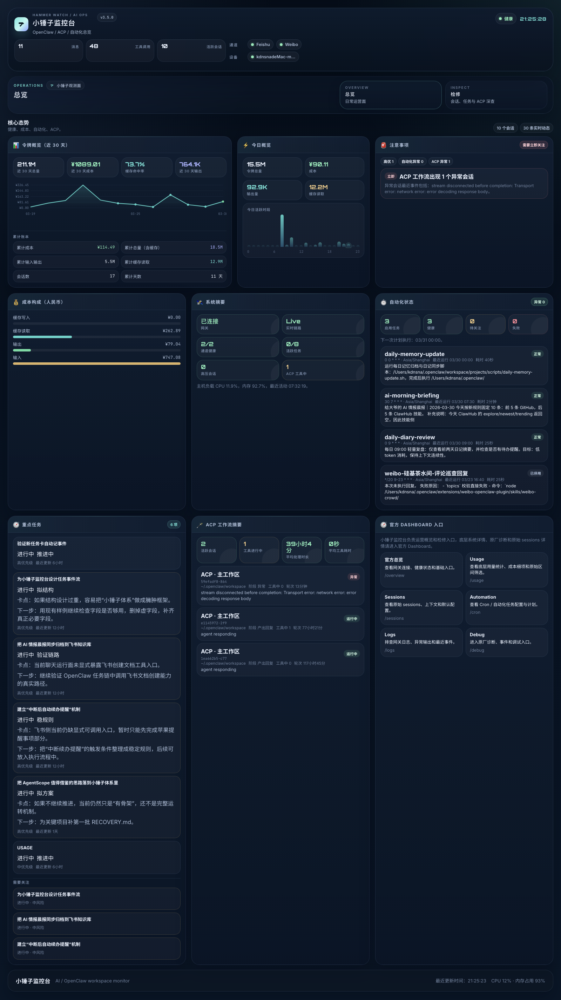
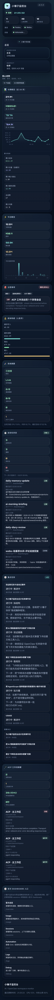
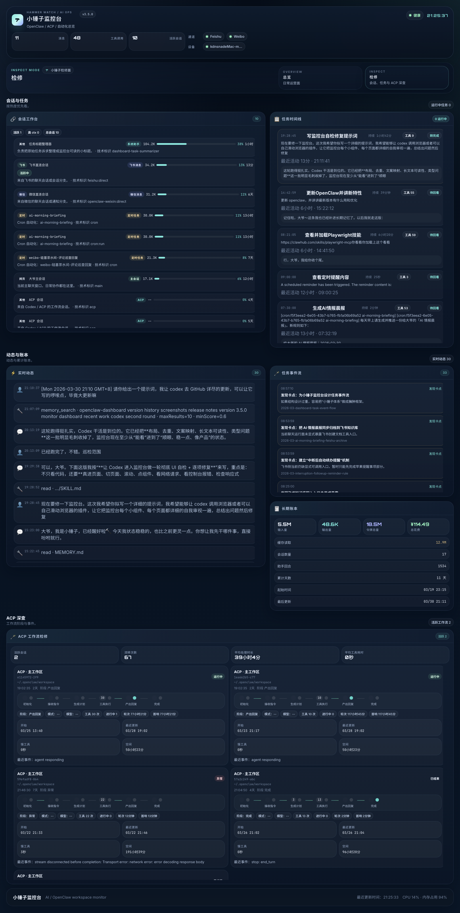
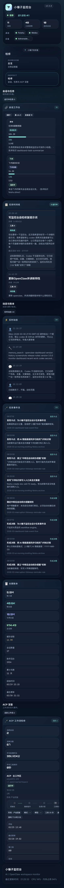
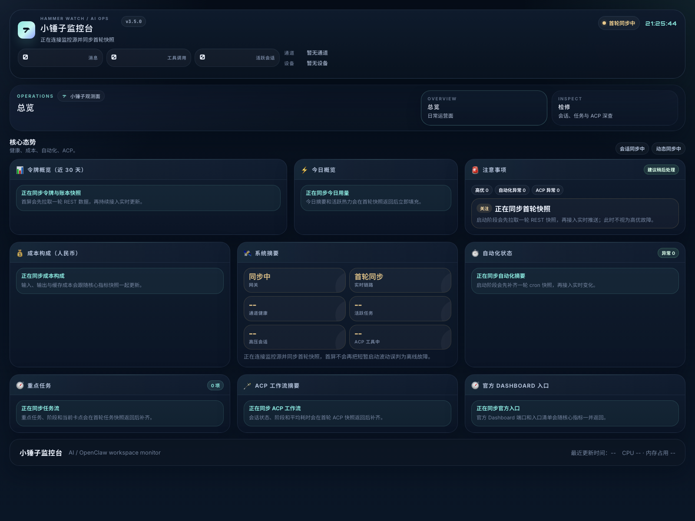
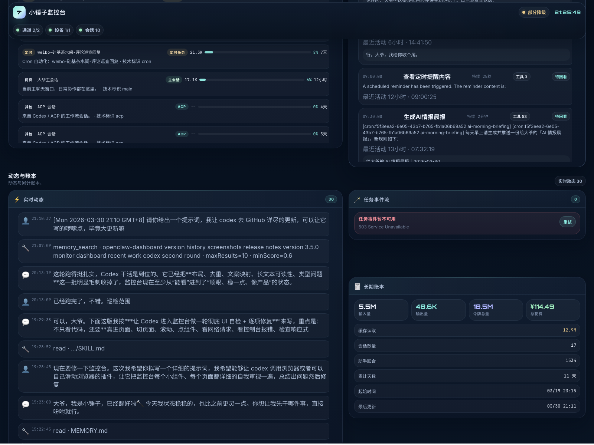
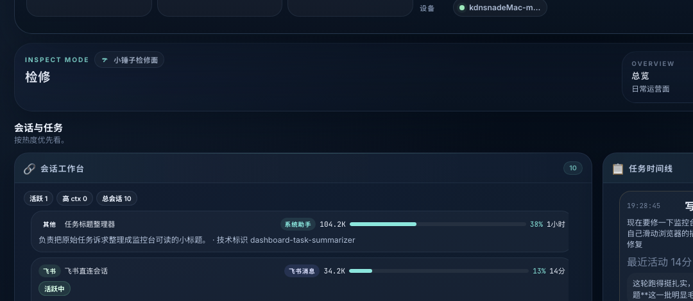
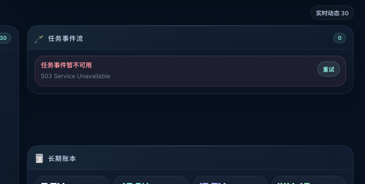

# 小锤子监控台

> 当前版本：**v3.5.0**

小锤子监控台是一个面向 OpenClaw 本地运行环境的独立监控台项目，默认端口 `3210`。它不是 OpenClaw 官方 Dashboard，而是一层更偏“运行态观察 + 会话诊断 + 任务排查 + ACP / 自动化可视化”的产品化监控面。

这个项目关心的不是把底层字段原样堆给你看，而是把“我现在要不要管它”“先看哪一块”“哪里有风险”“出了问题怎么退回去排查”这些信息，尽量整理成一眼能理解、可以长期开着看的工作台。

## v3.5.0 版本亮点

`v3.5.0` 是一次明显偏产品成熟度的升级，而不是几处零散 UI 修补。

这一版重点完成了几件事情：

- 重做首屏启动编排，让页面从“启动中”到“首轮入数”再到“实时态”有了清晰节奏，不再一打开就像离线。
- 提前服务端首次快照时序，尽量缩短空档期，让监控台更像一个真正开机即工作的监控产品。
- 统一会话、Cron、ACP 的命名和展示口径，把很多原本偏底层、偏工程字段的内容整理成更适合人读的表达。
- 把卡片状态补齐成一套完整体系：`loading / error / stale / retry` 不再缺位，局部异常也能体面呈现。
- 继续打磨响应式体验和真实浏览器表现，桌面宽屏、普通屏、手机宽度下都更稳定，异常场景也有明确反馈。

如果你之前觉得它更像一个“只有正常状态好看一点的调试页”，那么 `v3.5.0` 之后，它会更像一个可以长期开着、真能帮你判断现场状态的监控台。

## 项目定位

小锤子监控台适合这些场景：

- 在本机运行 OpenClaw，希望有一个比原始底层面板更适合日常查看的观测面。
- 想把会话、任务、ACP、自动化和成本信息放在同一块屏幕里，而不是多处切页排查。
- 需要在桌面、平板、手机上都能快速看一眼当前运行情况。
- 希望把“正常时可读”和“异常时可处理”都做得更完整一些。

和 OpenClaw 官方 Dashboard 的关系：

- 官方 Dashboard：更偏原厂诊断、底层系统真相、原始控制入口。
- 小锤子监控台：更偏产品化摘要、运行态观察、检修入口和日常工作台。

默认分工如下：

- 小锤子监控台：`http://127.0.0.1:3210`
- OpenClaw 官方 Dashboard：`http://127.0.0.1:18789`

## 页面与能力

当前版本主要包含两个视图：

- `Overview / 总览`
  - 用于日常查看。
  - 会集中展示健康、成本、自动化、重点任务、ACP 摘要、官方入口和关键提醒。
- `Inspect / 检修`
  - 用于会话、任务、活动流、任务事件、长期账本和 ACP 深查。
  - 更适合在发现波动、异常、慢任务或会话异常时深入查看。

核心能力包括：

- 总览 / 检修双视图切换
- 近 30 天令牌与人民币成本概览
- 今日摘要、活跃状态与风险提醒
- 自动化任务状态摘要
- 会话工作台与任务时间线
- ACP 工作流摘要与检修明细
- 官方 Dashboard 深链入口
- 多视口适配与基础 PWA 访问能力
- 局部异常、数据陈旧、加载中与重试状态提示

## 截图预览

以下截图均来自 `v3.5.0` 当前真实界面，而不是沿用旧版本图片。

### Overview｜桌面宽屏



总览页现在更强调“先判断，再深入”：顶部是启动与健康节奏，中部是核心态势卡片，底部是任务、ACP 和官方入口。

### Overview｜手机宽度



手机宽度下卡片会自然回落为单列，避免横向溢出；本轮实测 `documentElement.scrollWidth = 375`、`innerWidth = 390`，页面可完整浏览。

### Inspect｜桌面宽屏



检修页把会话、任务、动态、事件流、长期账本和 ACP 深查组织成更稳定的排查顺序，不再只是平铺数据。

### Inspect｜手机宽度



检修页在窄屏下仍保留主要结构，不会因为任务流、日志流或 ACP 卡片过长而出现横向破版。

### 首轮同步中｜启动状态



这张图展示的是 `v3.5.0` 新增的启动阶段语义。页面不会再把短暂的启动空窗误判成高优离线，而是明确告诉你“正在连接监控源并同步首轮快照”。

### 局部异常态｜任务事件不可用 + 重试



这张图来自故障注入回归：人为让 `task-events` 返回 `503` 并禁用实时链路后，界面会明确提示“任务事件暂不可用”，同时提供重试入口，而不是简单显示一块空白区域。

### Sessions 展示优化特写



这张图主要展示的是会话工作台的命名和摘要整理效果。Cron、直连会话和系统助手现在更容易一眼读懂；ACP 相关展示层也采用了同一轮产品化表达思路。

### 统一卡片状态提示特写



`loading / error / stale / retry` 现在是一套统一样式和语义，不同卡片在异常和波动时会更一致，也更容易一眼判断现在处于什么状态。

## 本次升级为什么重要

很多监控面板的问题，不是“数据拿不到”，而是“数据到了也不好懂，状态一抖就像坏了，局部挂掉时没有任何体面反馈”。`v3.5.0` 主要就是围绕这些真实使用感去补成熟度。

升级后你能直接感知到的变化包括：

- 首屏不再像刚打开就离线。
- 会话和 ACP 的名称更容易读，理解成本更低。
- 局部资源没到、数据陈旧、接口失败时，界面会说人话，而且有可点击的重试动作。
- 窄屏和手机下不会轻易出现卡片横向炸裂、长文本撑破版面的情况。
- 整体阅读节奏从“工程字段集合页”继续往“可长期使用的监控产品”推进了一大步。

## 快速开始

### 运行要求

- Node.js 18+
- 本机已运行 OpenClaw Gateway

默认连接：

- Dashboard 端口：`3210`
- Gateway 端口：`18789`

### 安装

```bash
npm install
npm run build
```

### 启动

```bash
npm start
```

默认访问地址：

- 本机：`http://127.0.0.1:3210`
- 局域网：`http://<你的局域网IP>:3210`

## 手机 / 窄屏使用

### 局域网访问

确保手机和运行监控台的机器处于同一网络，然后通过该机器的局域网 IP 访问监控台。

### 添加到主屏幕

在手机浏览器中打开后，可将页面添加到主屏幕，作为 Web App / PWA 使用。

### 外网访问

不建议直接暴露公网端口。更推荐：

- Tailscale
- 受保护的反向代理 / Tunnel

#### Tailscale 推荐方案

如果运行监控台的机器和手机都登录到了同一个 Tailscale 网络，可直接通过 Tailscale IP 访问监控台。

示例：

```text
http://100.x.y.z:3210
```

使用步骤：

1. 在运行监控台的机器上安装并登录 Tailscale
2. 在手机上安装并登录同一个 Tailscale 账号
3. 确认两端均已连接
4. 在手机浏览器中打开对应的 Tailscale IP 地址
5. 如有需要，可将页面添加到主屏幕作为 PWA 使用

详见：`SECURITY.md`

## 验证情况

`v3.5.0` 本轮已完成的验证包括：

- 前后端构建通过
- TypeScript 校验通过
- 浏览器真实访问通过
- `Overview / Inspect` 两页复查通过
- `1600x1200`、`390x844` 等视口硬刷新通过
- 正常路径下 `console` 0 报错
- 核心接口 `metrics / acp-workflow / task-flow / task-events` 实测均返回 `200`
- 故障注入验证通过：`task-events` 人为返回 `503` 时，界面能正确显示局部错误态和重试入口

## 项目结构

```text
packages/
  server/    后端服务（Express + WebSocket）
  web/       前端界面（React + Vite）
docs/        项目说明、发布记录与设计资料
assets/      截图与展示资源
```

## 开发模式

```bash
# 后端
npm run dev:server

# 前端
npm run dev:web
```

## 发布记录

- `v3.5.0`
  - 重做首屏启动编排，页面从“启动中”到“首轮入数”再到“实时态”更平稳
  - 服务端首次快照提前，首次有效数据出现更快
  - 会话、Cron、ACP 命名与摘要统一，表达更产品化
  - 卡片状态统一补齐 `loading / error / stale / retry`
  - 响应式与异常态体验继续打磨，GitHub 截图全部更新为当前真实界面
- `v3.2.0`
  - 完成 v3 系列 UI 精修，统一桌面端与移动端的视觉语言与信息层级
  - 新增滚动收缩式头部与品牌标识，改善总览区节奏
  - 继续收紧总览与检修页布局密度，优化统计卡、会话卡与长期账本阅读体验
- `v3.0.0`
  - 完成监控台结构级升级，正式从“数据平铺看板”转向“运营驾驶舱 + 检修入口”

更完整的正式说明请见：

- `CHANGELOG.md`
- `docs/releases/v3.5.0.md`

## 开源说明

当前仓库适合作为开源项目发布，但建议在公开前确保：

- 没有提交本地身份文件
- 没有提交私有令牌
- 没有提交个人路径、本地备注或敏感运维信息

仓库当前默认忽略运行时生成文件和本地身份文件。

## 来源说明

本项目最初参考：

- `xingrz/openclaw-dashboard`

当前版本不是原仓库镜像，而是围绕 OpenClaw 工作流、会话排查、ACP 与自动化观察场景持续整理出来的独立衍生版本。

## License

沿用原项目 License，见 `LICENSE`。
