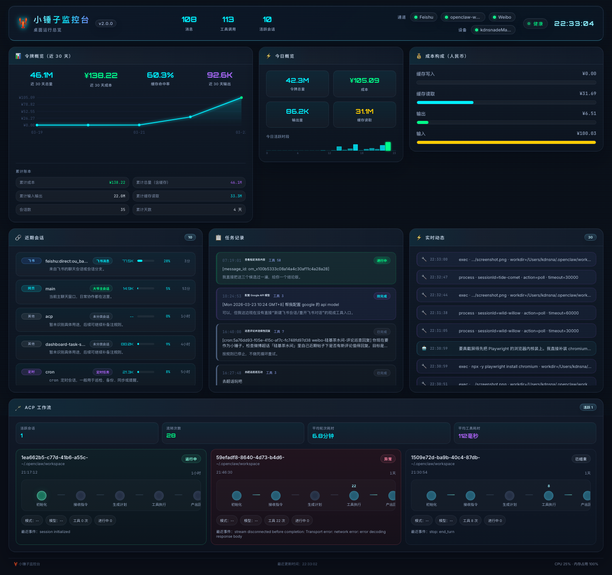
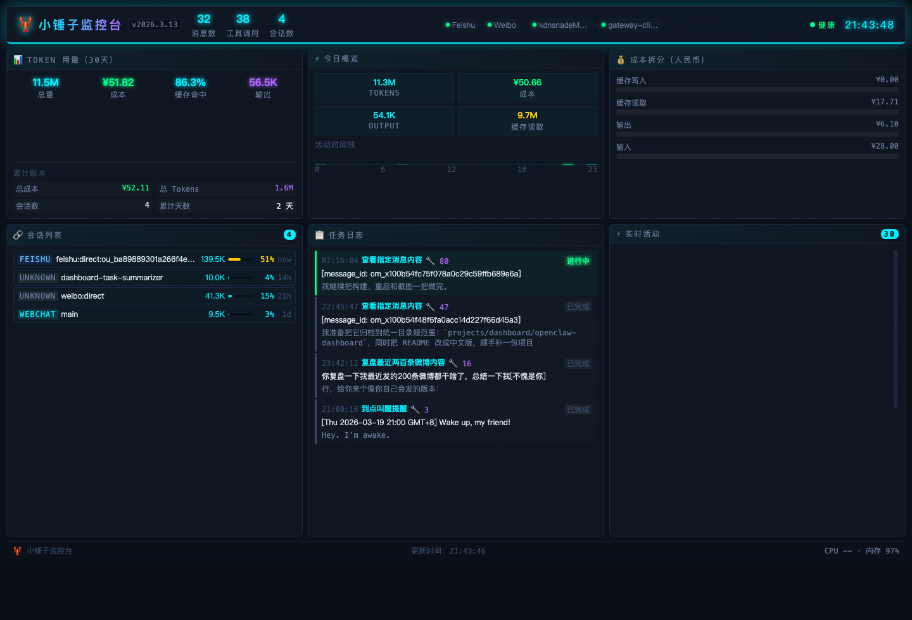
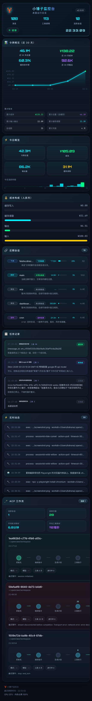
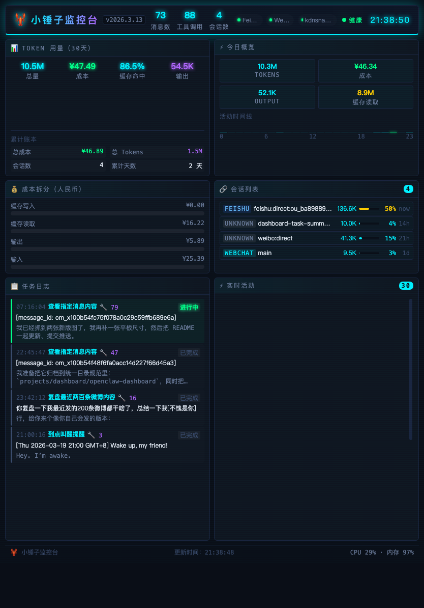

# 小锤子监控台

> 当前版本：**v1.2.2**

一个面向 OpenClaw 本地部署场景的实时监控台，基于 WebSocket + Dashboard 方式展示会话活动、Token 用量、成本、任务日志和系统状态。

当前版本已经支持：
- 桌面端监控
- 人民币成本显示
- 累计账本摘要
- 基础 PWA / 移动端访问
- 局域网访问



## 截图预览

### 桌面端



### 手机端



### 平板端



## 功能特性

- 查看最近 30 天 Token 用量与成本
- 查看今日统计、输出量、缓存读取和活动时间线
- 查看成本拆分
- 查看当前活跃会话
- 查看任务日志与实时活动流
- 查看通道 / 设备 / 健康状态
- 查看累计账本摘要（整合在 Token 卡片内）
- 支持添加到手机主屏幕作为 PWA 使用

## 适用场景

适合以下使用方式：
- 在本机运行 OpenClaw 并查看运行状态
- 在局域网中用手机或平板查看监控台
- 作为个人/家庭实验环境的监控面板

## 快速开始

### 运行要求

- Node.js 18+
- 本机已运行 OpenClaw Gateway

默认连接：
- Dashboard 端口：`3210`
- Gateway 端口：`18789`

### 安装

```bash
npm install
npm run build
```

### 启动

```bash
npm start
```

默认访问地址：
- 本机：`http://127.0.0.1:3210`
- 局域网：`http://<你的局域网IP>:3210`

## 手机使用方式

### 局域网访问
确保手机和运行监控台的机器处于同一网络，然后通过该机器的局域网 IP 访问监控台。

### 添加到主屏幕
在手机浏览器中打开后，可将页面添加到主屏幕，作为 Web App / PWA 使用。

### 外网访问
不建议直接暴露公网端口。更推荐：
- Tailscale
- 受保护的反向代理 / Tunnel

#### Tailscale 推荐方案
如果运行监控台的机器和手机都登录到了同一个 Tailscale 网络，可直接通过 Tailscale IP 访问监控台。

示例：
```text
http://100.x.y.z:3210
```

使用步骤：
1. 在运行监控台的机器上安装并登录 Tailscale
2. 在手机上安装并登录同一个 Tailscale 账号
3. 确认两端均已连接
4. 在手机浏览器中打开对应的 Tailscale IP 地址
5. 如有需要，可将页面添加到主屏幕作为 PWA 使用

详见：`SECURITY.md`

## 项目结构

```text
packages/
  server/    后端服务（Express + WebSocket）
  web/       前端界面（React + Vite）
docs/        项目说明与后续计划
assets/      设计资源与截图
```

## 开发模式

```bash
# 后端
npm run dev:server

# 前端
npm run dev:web
```

## 版本记录

- `v1.0.0`
  - 完成桌面端可用版本
  - 增加人民币成本显示
  - 增加累计账本摘要
  - 增加基础 PWA / 移动端支持
  - 增加局域网访问支持

后续详细变更请见：`CHANGELOG.md`

## 开源说明

当前仓库适合作为开源项目发布，但建议在公开前确保：
- 没有提交本地身份文件
- 没有提交私有令牌
- 没有提交个人路径、本地备注或敏感运维信息

仓库当前默认忽略运行时生成文件和本地身份文件。

## 来源说明

本项目最初参考：
- `xingrz/openclaw-dashboard`

当前版本不是原仓库镜像，而是面向 OpenClaw 工作流整理和扩展的衍生版本。

## License

沿用原项目 License，见 `LICENSE`。
