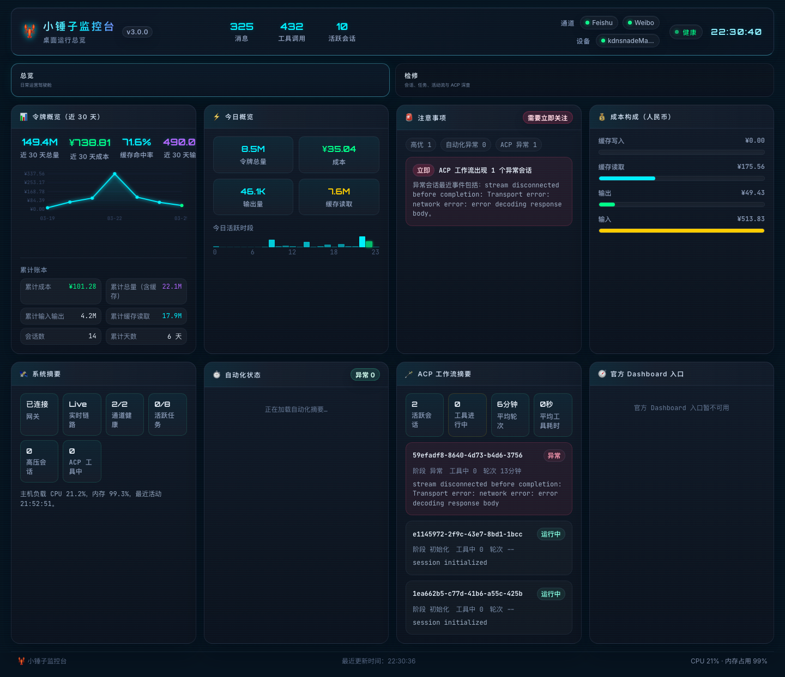
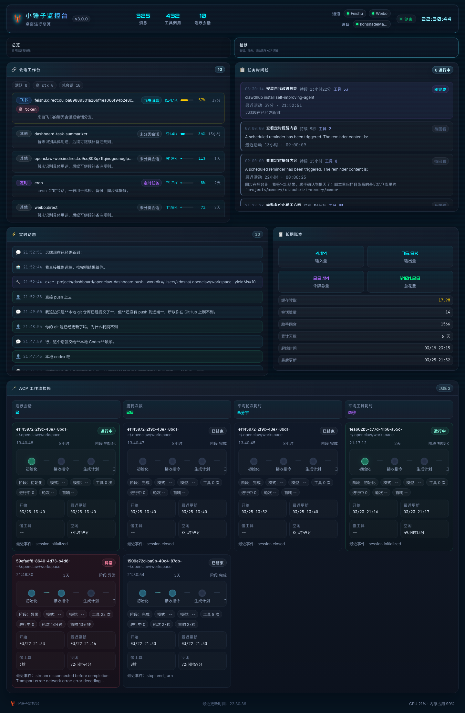
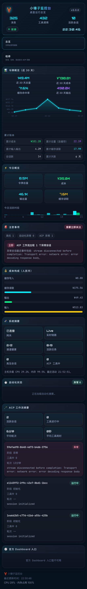

# 小锤子监控台

> 当前版本：**v3.0.0**

一个面向 OpenClaw 本地部署场景的实时监控台，基于 WebSocket + Dashboard 方式展示会话活动、Token 用量、成本、任务日志、ACP 工作流、自动化状态和系统摘要。

当前版本已经支持：
- 总览 / 检修双视图切换
- 人民币成本显示与近 30 天账本概览
- 今日概览、关注提醒与系统摘要
- 自动化任务状态摘要
- 会话工作台与任务时间线
- ACP 工作流摘要 + 检修视图
- 官方 Dashboard 深链入口
- 基础 PWA / 移动端访问
- 局域网访问

> v3.0.0 是一次结构级升级：监控台不再只是平铺展示数据，而是明确转向“运营驾驶舱 + 检修入口”。


## 截图预览

### 桌面端｜总览视图（v3）



### 桌面端｜检修视图（v3）



### 手机端｜总览视图（v3）



> 注：README 截图位已切换到 v3 命名与展示结构，若本地尚未生成对应截图文件，请补抓后再推送仓库。

## 功能特性

- 总览 / 检修双视图切换
- 查看最近 30 天 Token 用量、人民币成本与累计账本摘要
- 查看今日统计、输出量、缓存读取和活跃时段
- 自动生成关注提醒，帮助判断“现在先看什么”
- 查看系统摘要、连接状态与官方 Dashboard 快捷入口
- 查看自动化任务状态（如日结、巡检、备份等）的摘要信息
- 查看会话工作台（按风险和活跃程度优先展示）
- 查看任务时间线与实时活动流
- 查看 ACP 工作流摘要与完整检修视图
- 支持添加到手机主屏幕作为 PWA 使用

## 适用场景

适合以下使用方式：
- 在本机运行 OpenClaw 并查看运行状态
- 在局域网中用手机或平板查看监控台
- 作为个人/家庭实验环境的监控面板

## 快速开始

### 运行要求

- Node.js 18+
- 本机已运行 OpenClaw Gateway

默认连接：
- Dashboard 端口：`3210`
- Gateway 端口：`18789`

### 安装

```bash
npm install
npm run build
```

### 启动

```bash
npm start
```

默认访问地址：
- 本机：`http://127.0.0.1:3210`
- 局域网：`http://<你的局域网IP>:3210`

## 手机使用方式

### 局域网访问
确保手机和运行监控台的机器处于同一网络，然后通过该机器的局域网 IP 访问监控台。

### 添加到主屏幕
在手机浏览器中打开后，可将页面添加到主屏幕，作为 Web App / PWA 使用。

### 外网访问
不建议直接暴露公网端口。更推荐：
- Tailscale
- 受保护的反向代理 / Tunnel

#### Tailscale 推荐方案
如果运行监控台的机器和手机都登录到了同一个 Tailscale 网络，可直接通过 Tailscale IP 访问监控台。

示例：
```text
http://100.x.y.z:3210
```

使用步骤：
1. 在运行监控台的机器上安装并登录 Tailscale
2. 在手机上安装并登录同一个 Tailscale 账号
3. 确认两端均已连接
4. 在手机浏览器中打开对应的 Tailscale IP 地址
5. 如有需要，可将页面添加到主屏幕作为 PWA 使用

详见：`SECURITY.md`

## 项目结构

```text
packages/
  server/    后端服务（Express + WebSocket）
  web/       前端界面（React + Vite）
docs/        项目说明与后续计划
assets/      设计资源与截图
```

## 开发模式

```bash
# 后端
npm run dev:server

# 前端
npm run dev:web
```

## 版本记录

- `v3.0.0`
  - 完成监控台结构级升级，正式从“数据平铺看板”转向“运营驾驶舱 + 检修入口”
  - 新增总览 / 检修双视图切换，明确区分日常查看与深入排查场景
  - 新增关注提醒卡片（AttentionCard），将系统状态、成本、会话与 ACP 活动转成可行动提示
  - 新增系统摘要卡片（SystemSummaryCard），用轻量方式承接底层系统状态，并减少与官方 Dashboard 的重复建设
  - 新增自动化状态卡片（AutomationStatusCard），接入 Cron / 自动化任务摘要能力
  - 新增官方 Dashboard 深链卡片（OfficialDashboardLinksCard），让 3210 与 18789 形成“摘要层 + 深层诊断入口”的分工关系
  - 新增 ACP 工作流摘要卡（AcpWorkflowSummaryCard），首页可快速判断 ACP 运行态，检修页继续保留完整明细
  - 将会话卡升级为“会话工作台”，按风险与活跃优先级排序，并增加高 ctx / 高 token / 活跃中等风险提示
  - 将任务记录升级为“任务时间线”，补充持续时长、最近活动时间、需关注状态等信息
  - 强化 ACP 工作流检修视图，增加阶段、开始时间、最近更新时间、慢工具、空闲时长等更多诊断信息
  - 前端样式完成大规模重构，增加新布局、新卡片、新摘要模块和更完整的响应式适配
  - 后端新增自动化状态聚合与官方 Dashboard 链接输出，为前端新视图提供数据基础
- `v2.0.0`
  - 接入 ACP 工作流可视化数据
  - 更新监控台版本号、文档与展示截图
  - 补充已知问题说明：宽屏浏览器下偶发卡片大小与风格错位，预计下个版本修复
- `v1.2.2`
  - 保留科技黑蓝底的大背景不变，继续做暗色 Apple-ish 细节精修
  - 会话列表加入项目备注与中文说明，便于区分 cron / 主会话 / 各类消息来源
  - 监控台整体样式继续优化：卡片、badge、状态点、边框、阴影与层级更细腻
  - 安全侧新增插件白名单、插件基线、夜间显性安全巡检，并完成 Feishu doc/wiki 能力收缩
- `v1.1.0`
  - 调整 Token 卡片文案，明确区分“近 30 天 / 账单口径”和“累计账本（全历史）”
  - 修正累计账本摘要中的总 Tokens 展示，避免把“输入+输出”误显示成“累计总量”
  - 增加累计输入输出与累计缓存读取拆分，减少口径误解
- `v1.0.0`
  - 完成桌面端可用版本
  - 增加人民币成本显示
  - 增加累计账本摘要
  - 增加基础 PWA / 移动端支持
  - 增加局域网访问支持

后续详细变更请见：`CHANGELOG.md`

## 开源说明

当前仓库适合作为开源项目发布，但建议在公开前确保：
- 没有提交本地身份文件
- 没有提交私有令牌
- 没有提交个人路径、本地备注或敏感运维信息

仓库当前默认忽略运行时生成文件和本地身份文件。

## 来源说明

本项目最初参考：
- `xingrz/openclaw-dashboard`

当前版本不是原仓库镜像，而是面向 OpenClaw 工作流整理和扩展的衍生版本。

## License

沿用原项目 License，见 `LICENSE`。
